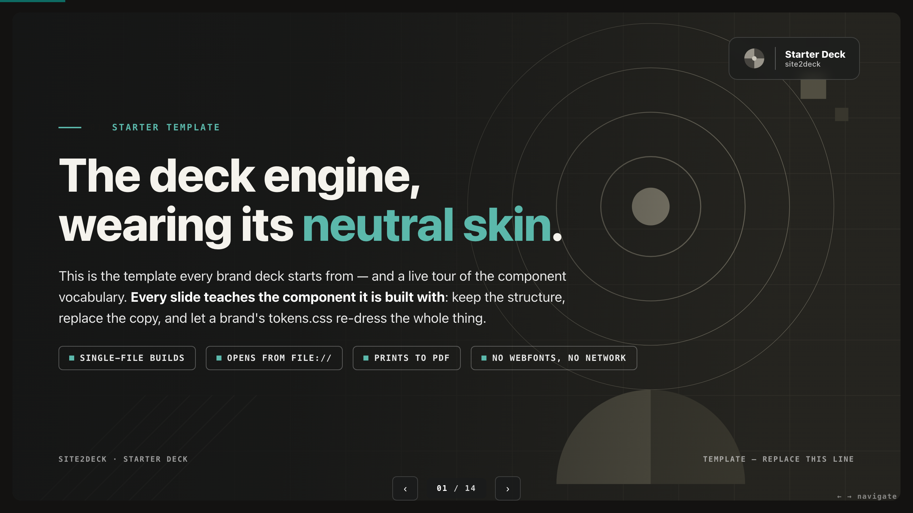
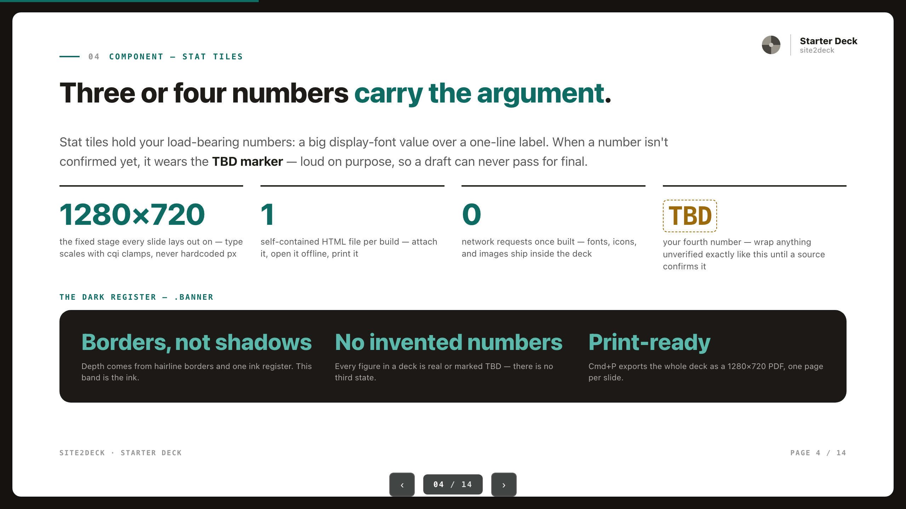
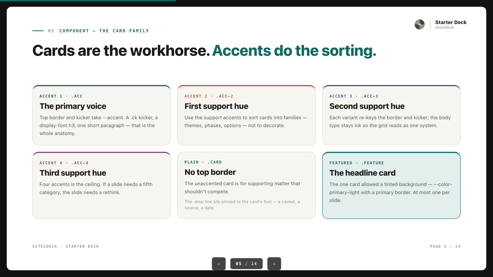
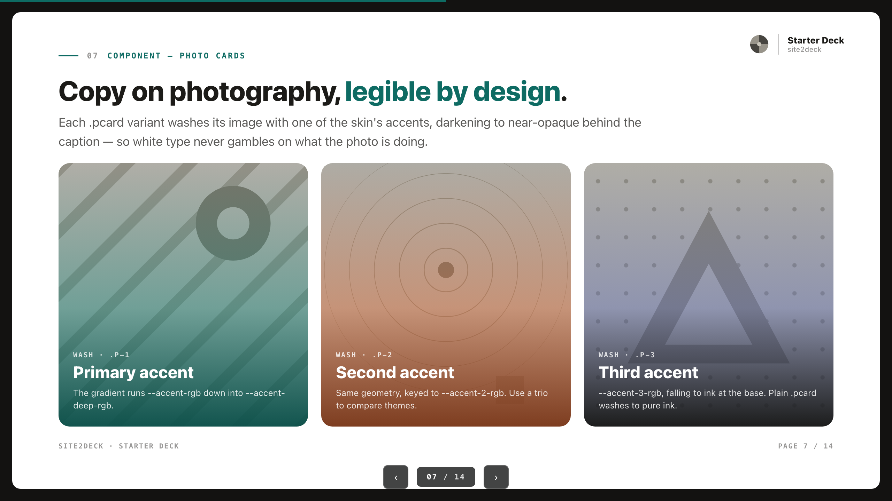
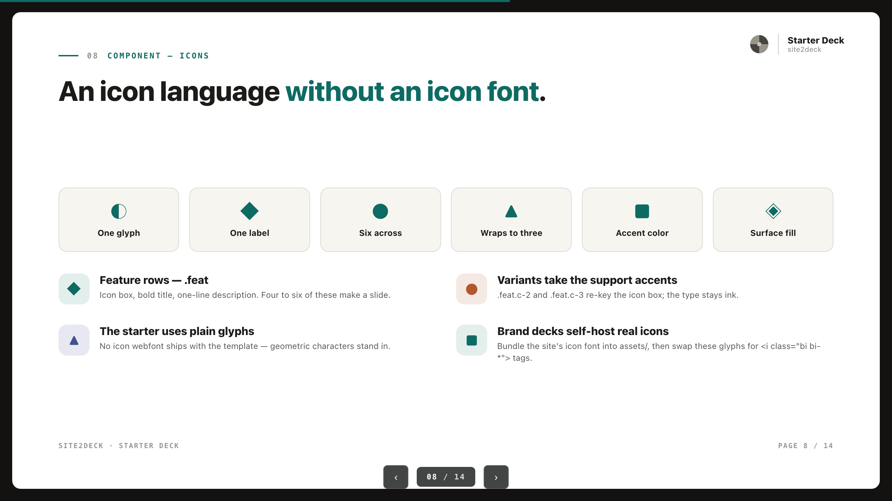

<div align="center">

# site2deck

**Turn any company website into a branded, offline, single-file HTML slide deck.**

Point it at a site → get its colors, fonts, logo, and icons as a `tokens.css` skin → author slides on a brand-neutral engine → build **one standalone HTML file** that opens from `file://`, travels as an email attachment, and prints to PDF.

[**Website**](https://fritzhand.github.io/site2deck/) · [**Live demo**](https://fritzhand.github.io/site2deck/demo.html) · [**Component catalog**](docs/components.md) · [**The method**](docs/method.md)

[](https://github.com/fritzhand/site2deck/generate)


<br>

<a href="https://fritzhand.github.io/site2deck/demo.html"></a>

*The starter deck, wearing the engine's neutral skin. Every deck starts here; a brand's `tokens.css` re-dresses the whole thing.*

</div>

## What it looks like

Four slides from the [live starter deck](https://fritzhand.github.io/site2deck/demo.html) — stat tiles, the card family, photo cards, icon feature rows. Same markup, any brand: the skin is ~40 CSS custom properties.

| | |
| --- | --- |
|  |  |
|  |  |

## How it works

1. **Extract** — scrape the design system straight off the website: colors, fonts, logo, iconography, meta. Don't reinvent the brand; sample it.
2. **Skin** — encode the brand as a `tokens.css` file: ~40 CSS custom properties (about 70 lines) plus `@font-face` blocks. The engine in `shared/` ships zero brand values; the skin is the only brand surface.
3. **Author** — write slides in `index.html` using the component vocabulary (`.card`, `.stats`, `.banner`, `.road`, `.split`, …). Composition, not freeform HTML.
4. **Build** — `build.mjs` inlines every stylesheet, script, font, and image into one standalone HTML with zero external references.
5. **Iterate** — open the deck in a browser, spot-check by eye against the real site, edit tokens and slides, reload. Extraction gives you a first draft; the spot-check is the actual design step.

```
yourcompany.com
      │
      │  node extract.mjs        colors · fonts · logo · icons · meta
      ▼
decks/acme/tokens.css            the brand as custom properties (the skin)
      +
shared/deck.css + deck.js        brand-neutral engine (never edited per brand)
      │
      │  author decks/acme/index.html    slides from the component vocabulary
      ▼
      │  node build.mjs acme     inline CSS/JS/fonts/images as data URIs
      ▼
decks/acme/acme-standalone.html  one file — file:// · email · print-to-PDF
```

## Quickstart

Requirements: Node ≥ 18. No `npm install` — there are no dependencies.

> **Starting fresh?** Click [**Use this template**](https://github.com/fritzhand/site2deck/generate) to spin up your own copy of this repo — decks you author stay in your repo, and the starter deck comes along as a live reference.

```bash
git clone https://github.com/fritzhand/site2deck && cd site2deck

# 1. Extract the brand (deck is named from the domain; override with --name)
node extract.mjs https://yourcompany.com

# 2. Open the scaffolded deck — file:// works, no server needed
open decks/yourcompany/index.html

# 3. Refine: work through the TODO(spot-check) comments in
#    decks/yourcompany/tokens.css, then write your slides in index.html

# 4. Build the shareable single file
node build.mjs yourcompany            # → decks/yourcompany/yourcompany-standalone.html

# 5. Optional: the redacted external cut (drops slides tagged data-internal)
node build.mjs yourcompany --public   # → decks/yourcompany/yourcompany-public.html
```

`npm run extract -- <url>`, `npm run build -- <name>`, and `npm run serve` (a local `http.server` on :8000) exist as aliases, but the `node` commands above are the whole interface. (The optional serve alias shells out to `python3`; decks also open straight from `file://`, so serving is never required.) Re-running `extract.mjs` on an existing deck refuses to overwrite your work unless you pass `--force`.

## What your website needs

`extract.mjs` reads the site's server-rendered HTML and CSS. Every signal has a fallback, and the extractor prints a scorecard telling you exactly what it found and what it missed. The short version:

| Signal | Best case | Fallback |
| --- | --- | --- |
| [Colors](docs/website-requirements.md#colors) | CSS custom properties with brand-ish names; `theme-color` meta | most-used hex values across the stylesheets |
| [Fonts](docs/website-requirements.md#fonts) | Google Fonts `<link>` or `@font-face` with woff2 | system font stack + a TODO to hand-download |
| [Logo](docs/website-requirements.md#logo) | `` with "logo" in src/alt/class, SVG preferred | `apple-touch-icon`, then `og:image` |
| [Icons](docs/website-requirements.md#icons) | a recognizable library (Bootstrap Icons, Font Awesome, Material, Lucide, Heroicons, Phosphor) | no icon font; use text labels |
| [Meta](docs/website-requirements.md#meta) | `og:site_name`, `og:image`, `theme-color`, favicon | the domain name |

[JS-rendered SPAs](docs/website-requirements.md#js-rendered-sites) are the one hard case — if the CSS never reaches the wire as CSS, there is little to sample. The full story, signal by signal, including how to fix each gap by hand: [docs/website-requirements.md](docs/website-requirements.md).

## Repo tour

```
site2deck/
├── extract.mjs              # website → decks/<name>/ scaffold + brand report
├── build.mjs                # inline everything → one shareable HTML
├── shared/
│   ├── deck.css             # brand-neutral engine: 1280×720 stage, components, print
│   └── deck.js              # keyboard/click/touch nav, progress, hash deep-links
├── decks/
│   ├── starter/             # kitchen-sink template deck, neutral skin — every component, live
│   └── <brand>/             # created by extract.mjs
│       ├── index.html       # the deck (edit this)
│       ├── tokens.css       # the brand skin — the only file that knows the brand
│       ├── assets/          # logo, photos, self-hosted icons
│       ├── fonts/           # brand woff2 (weights 400–800)
│       └── brand-report.json  # what extraction found, per signal
├── docs/
│   ├── method.md            # why the method works
│   ├── components.md        # the slide-authoring vocabulary
│   ├── website-requirements.md  # what extract.mjs needs from a site
│   └── screenshots/         # README + social-preview images
├── prompts/
│   └── build-my-skin.md     # paste-into-an-AI prompt for skin refinement
└── CLAUDE.md                # instructions for AI coding agents working in this repo
```

Generated `*-standalone.html` / `*-public.html` files are git-ignored — they are build artifacts. Edit `index.html`, rerun the build.

## Key features

**Standalone build.** `build.mjs` converts linked CSS to `<style>` blocks, scripts to inline `<script>`, and every font, image, and favicon to a data URI. The build **fails loudly** if any relative reference survives inlining, so a "standalone" file can never quietly depend on the network. Keep source images sensible (≈1600px max, quality ~70) — recompressing photos is the difference between a 15 MB standalone and a 4 MB one.

**Public redaction.** Add `data-internal` to a slide's `<section>` tag and `node build.mjs <name> --public` strips it from the output — and refuses to ship if any `data-internal` section survives stripping. The nav derives the slide count from the DOM at load, so nothing needs renumbering — one source deck, two audiences.

**Print to PDF.** The `@media print` block renders every slide at exactly 1280×720 with colors intact (`@page { size: 1280px 720px }`). Browser Print → Save as PDF works; headless: `chromium --headless --print-to-pdf=deck.pdf decks/acme/acme-standalone.html`.

**`.tbd` unknown markers.** Any fact you don't actually have — a unit cost, a market size, a date — is wrapped in `<span class="tbd">TBD confirm with finance</span>` and renders loud (amber, dashed border). Drafts can't quietly pass as final; search for `class="tbd"` before anything goes external.

**Per-deck portability.** Everything a deck references lives under its own `decks/<name>/assets/` and `/fonts/` — only `../shared/` is common. A deck folder can be copied out of the repo, or copied within it as the starting point for the next deck.

**AI-assisted skin refinement.** Extraction gets the skin ~80% right; the last 20% is judgment. [prompts/build-my-skin.md](prompts/build-my-skin.md) is a ready-made prompt for handing that refinement to an AI assistant, and [CLAUDE.md](CLAUDE.md) teaches coding agents the repo's contracts so they stay on-system.

**Component vocabulary.** Slides compose a fixed set of classes — stat tiles, accent cards, photo cards, roadmap lanes, icon feature rows, device frames — all consuming the same tokens, so every slide stays on-brand by construction. The full catalog with markup for each: [docs/components.md](docs/components.md).

**The method.** Why sampling beats guessing, why tokens are the only brand surface, why single-file is a design constraint and not just a convenience: [docs/method.md](docs/method.md). The approach has been proven twice in real client work; this repo packages it.

## Honest limitations

- **The extractor parses CSS with regexes,** not a real CSS engine. Unusual minification, deep `@import` chains, and computed values can slip past it. That's why the output is a scaffold with `TODO(spot-check)` comments, not a finished skin.
- **JS-rendered SPAs extract poorly.** `extract.mjs` fetches HTML and CSS; it does not run a browser. If the site paints entirely from JavaScript, expect a sparse scorecard — see [JS-rendered sites](docs/website-requirements.md#js-rendered-sites) for the options, ending with the [manual skin path](docs/website-requirements.md#manual-skin-path).
- **Brand assets belong to the brand.** Logos, fonts, and photos you download are the company's property. Building a deck *for* that company (or with permission) is the intended use; check the font's license before self-hosting it.
- **Extraction is a first draft.** The tool gets the values; a human (or an AI with a human's eye on it) confirms they read right on a slide. The spot-check loop is the actual design step, not an optional polish pass.

## License

MIT — see [LICENSE](LICENSE).
